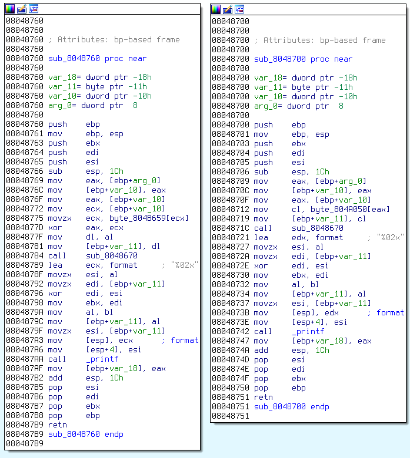

# Advanced Risqué Machine - Solution overview

The challenge consists of a `tar.bz2` file, so we decompress it and see a file named `ccb516735156cbd2cb9282504e8663e6`. Let's run `file` on it to see what it is:

	$ file ccb516735156cbd2cb9282504e8663e6
	ccb516735156cbd2cb9282504e8663e6: ELF 32-bit LSB  executable, Intel 80386, version 1 (SYSV), dynamically linked (uses shared libs), for GNU/Linux 2.6.24, BuildID[sha1]=d0207b3a4d5cd9248355e541f92de2a2b85041ec, stripped

Okay, looks like an executable. That makes sense, since this is a reverse engineering challenge. Let's run it and see what happens:

	$ ./ccb516735156cbd2cb9282504e8663e6
	[1]    26295 illegal hardware instruction (core dumped)  ./ccb516735156cbd2cb9282504e8663e6

That's not very nice. Let's run it under `strace` to see why it's doing that:

	trace ./ccb516735156cbd2cb9282504e8663e6
	execve("./ccb516735156cbd2cb9282504e8663e6", ["./ccb516735156cbd2cb9282504e8663"...], [/* 39 vars */]) = 0
	[...]
	rt_sigaction(SIGALRM, {0x8048850, [ALRM], SA_RESTART}, {SIG_DFL, [], 0}, 8) = 0
	rt_sigaction(SIGPIPE, {0x80488a0, [PIPE], SA_RESTART}, {SIG_DFL, [], 0}, 8) = 0
	rt_sigaction(SIGUSR2, {0x80488f0, [USR2], SA_RESTART}, {SIG_DFL, [], 0}, 8) = 0
	rt_sigaction(SIGUSR1, {0x8048940, [USR1], SA_RESTART}, {SIG_DFL, [], 0}, 8) = 0
	gettid()                                = 26402
	tgkill(26402, 26402, SIGALRM)           = 0
	--- SIGALRM {si_signo=SIGALRM, si_code=SI_TKILL, si_pid=26402, si_uid=1000} ---
	rt_sigaction(SIGALRM, {SIG_IGN, [ALRM], SA_RESTART}, {0x8048850, [ALRM], SA_RESTART}, 8) = 0
	tgkill(26402, 26402, SIGPIPE)           = 0
	--- SIGPIPE {si_signo=SIGPIPE, si_code=SI_TKILL, si_pid=26402, si_uid=1000} ---
	rt_sigaction(SIGPIPE, {SIG_IGN, [PIPE], SA_RESTART}, {0x80488a0, [PIPE], SA_RESTART}, 8) = 0
	tgkill(26402, 26402, SIGUSR2)           = 0
	--- SIGUSR2 {si_signo=SIGUSR2, si_code=SI_TKILL, si_pid=26402, si_uid=1000} ---
	rt_sigaction(SIGUSR2, {SIG_IGN, [USR2], SA_RESTART}, {0x80488f0, [USR2], SA_RESTART}, 8) = 0
	tgkill(26402, 26402, SIGUSR1)           = 0
	--- SIGUSR1 {si_signo=SIGUSR1, si_code=SI_TKILL, si_pid=26402, si_uid=1000} ---
	rt_sigaction(SIGUSR1, {SIG_IGN, [USR1], SA_RESTART}, {0x8048940, [USR1], SA_RESTART}, 8) = 0
	tgkill(26402, 26402, SIGILL)            = 0
	--- SIGILL {si_signo=SIGILL, si_code=SI_TKILL, si_pid=26402, si_uid=1000} ---
	+++ killed by SIGILL (core dumped) +++
	[1]    26399 illegal hardware instruction (core dumped)  strace ./ccb516735156cbd2cb9282504e8663e6

We can see from the `rt_sigaction` calls that it's installing signal handlers for `SIGALRM`, `SIGPIPE`, `SIGUSR2`, and `SIGUSR1`. Then, it produces those signals in that same order (`SIGALRM`, `SIGPIPE`, `SIGUSR2`, and `SIGUSR1`), and then ends up hitting a `SIGILL` and exiting.

Let's open it up in IDA and see what we can see. IDA finds the `main` function at `080489D0`. Right at the beginning of `main`, it's calling `_signal` 4 times to install signal handlers, and then calling `_raise` in order to raise a `SIGALRM`:

	.text:080489E1 8D 0D 50 88 04 08                             lea     ecx, handler
	.text:080489E7 C7 45 F0 00 00 00 00                          mov     [ebp+var_10], 0
	.text:080489EE C7 04 24 0E 00 00 00                          mov     dword ptr [esp], 0Eh ; sig
	.text:080489F5 89 4C 24 04                                   mov     [esp+4], ecx    ; handler
	.text:080489F9 89 45 CC                                      mov     [ebp+var_34], eax
	.text:080489FC E8 9F FA FF FF                                call    _signal
	.text:08048A01 B9 0D 00 00 00                                mov     ecx, 0Dh
	.text:08048A06 8D 15 A0 88 04 08                             lea     edx, sub_80488A0
	.text:08048A0C C7 04 24 0D 00 00 00                          mov     dword ptr [esp], 0Dh ; sig
	.text:08048A13 89 54 24 04                                   mov     [esp+4], edx    ; handler
	.text:08048A17 89 45 C8                                      mov     [ebp+var_38], eax
	.text:08048A1A 89 4D C4                                      mov     [ebp+var_3C], ecx
	.text:08048A1D E8 7E FA FF FF                                call    _signal
	.text:08048A22 B9 0C 00 00 00                                mov     ecx, 0Ch
	.text:08048A27 8D 15 F0 88 04 08                             lea     edx, sub_80488F0
	.text:08048A2D C7 04 24 0C 00 00 00                          mov     dword ptr [esp], 0Ch ; sig
	.text:08048A34 89 54 24 04                                   mov     [esp+4], edx    ; handler
	.text:08048A38 89 45 C0                                      mov     [ebp+var_40], eax
	.text:08048A3B 89 4D BC                                      mov     [ebp+var_44], ecx
	.text:08048A3E E8 5D FA FF FF                                call    _signal
	.text:08048A43 B9 0A 00 00 00                                mov     ecx, 0Ah
	.text:08048A48 8D 15 40 89 04 08                             lea     edx, sub_8048940
	.text:08048A4E C7 04 24 0A 00 00 00                          mov     dword ptr [esp], 0Ah ; sig
	.text:08048A55 89 54 24 04                                   mov     [esp+4], edx    ; handler
	.text:08048A59 89 45 B8                                      mov     [ebp+var_48], eax
	.text:08048A5C 89 4D B4                                      mov     [ebp+var_4C], ecx
	.text:08048A5F E8 3C FA FF FF                                call    _signal
	.text:08048A64 B9 0E 00 00 00                                mov     ecx, 0Eh
	.text:08048A69 C7 04 24 0E 00 00 00                          mov     dword ptr [esp], 0Eh ; sig
	.text:08048A70 89 45 B0                                      mov     [ebp+var_50], eax
	.text:08048A73 89 4D AC                                      mov     [ebp+var_54], ecx
	.text:08048A76 E8 05 FA FF FF                                call    _raise

Let's check out the `SIGALRM` handler, which IDA has automatically named `handler`:

	.text:08048850                               ; void handler(int)
	.text:08048850                               handler         proc near               ; DATA XREF: main+11o
	.text:08048850
	.text:08048850                               var_14          = dword ptr -14h
	.text:08048850                               var_10          = dword ptr -10h
	.text:08048850                               var_C           = dword ptr -0Ch
	.text:08048850                               var_8           = dword ptr -8
	.text:08048850                               var_4           = dword ptr -4
	.text:08048850                               arg_0           = dword ptr  8
	.text:08048850
	.text:08048850 55                                            push    ebp
	.text:08048851 89 E5                                         mov     ebp, esp
	.text:08048853 83 EC 28                                      sub     esp, 28h
	.text:08048856 8B 45 08                                      mov     eax, [ebp+arg_0]
	.text:08048859 B9 0E 00 00 00                                mov     ecx, 0Eh
	.text:0804885E BA 01 00 00 00                                mov     edx, 1
	.text:08048863 89 45 FC                                      mov     [ebp+var_4], eax
	.text:08048866 C7 04 24 0E 00 00 00                          mov     dword ptr [esp], 0Eh ; sig
	.text:0804886D 89 54 24 04                                   mov     [esp+4], edx    ; handler
	.text:08048871 89 4D F8                                      mov     [ebp+var_8], ecx
	.text:08048874 E8 27 FC FF FF                                call    _signal
	.text:08048879 B9 0D 00 00 00                                mov     ecx, 0Dh
	.text:0804887E C7 04 24 0D 00 00 00                          mov     dword ptr [esp], 0Dh ; sig
	.text:08048885 89 45 F4                                      mov     [ebp+var_C], eax
	.text:08048888 89 4D F0                                      mov     [ebp+var_10], ecx
	.text:0804888B E8 F0 FB FF FF                                call    _raise
	.text:08048890 89 45 EC                                      mov     [ebp+var_14], eax
	.text:08048893 83 C4 28                                      add     esp, 28h
	.text:08048896 5D                                            pop     ebp
	.text:08048897 C3                                            retn
	.text:08048897                               handler         endp

Looks like it's pretty straightforward: it acknowledges the received signal by calling `_signal` and then calls `_raise` to create a `SIGPIPE`. If we flip back to `main`, we see that the `SIGPIPE` handler the program installed is at `80488A0`. This function is not that much different from the previous one; it acknowledges the `SIGPIPE` and then calls `_raise` to create a `SIGUSR2`. If we check out the `SIGUSR2` handler, we see that it raises a `SIGUSR1`.

Once we reach the `SIGUSR1` handler at `08048940`, things start getting slightly more interesting:

	.text:08048940                               ; void sigusr1_handler(int)
	.text:08048940                               sigusr1_handler proc near               ; DATA XREF: main+78o
	.text:08048940
	.text:08048940                               var_1C          = dword ptr -1Ch
	.text:08048940                               var_18          = dword ptr -18h
	.text:08048940                               var_14          = dword ptr -14h
	.text:08048940                               var_10          = dword ptr -10h
	.text:08048940                               var_C           = dword ptr -0Ch
	.text:08048940                               var_8           = dword ptr -8
	.text:08048940                               arg_0           = dword ptr  8
	.text:08048940
	.text:08048940 55                                            push    ebp
	.text:08048941 89 E5                                         mov     ebp, esp
	.text:08048943 53                                            push    ebx
	.text:08048944 83 EC 24                                      sub     esp, 24h
	.text:08048947 8B 45 08                                      mov     eax, [ebp+arg_0]
	.text:0804894A B9 0A 00 00 00                                mov     ecx, 0Ah
	.text:0804894F BA 01 00 00 00                                mov     edx, 1
	.text:08048954 89 45 F8                                      mov     [ebp+var_8], eax
	.text:08048957 C7 04 24 0A 00 00 00                          mov     dword ptr [esp], 0Ah ; sig
	.text:0804895E 89 54 24 04                                   mov     [esp+4], edx    ; handler
	.text:08048962 89 4D F0                                      mov     [ebp+var_10], ecx
	.text:08048965 E8 36 FB FF FF                                call    _signal
	.text:0804896A C7 45 F4 00 00 00 00                          mov     [ebp+var_C], 0
	.text:08048971 89 45 EC                                      mov     [ebp+var_14], eax
	.text:08048974
	.text:08048974                               loc_8048974:                            ; CODE XREF: sigusr1_handler+6Dj
	.text:08048974 81 7D F4 09 16 00 00                          cmp     [ebp+var_C], 1609h
	.text:0804897B 0F 83 31 00 00 00                             jnb     loc_80489B2
	.text:08048981 8B 45 F4                                      mov     eax, [ebp+var_C]
	.text:08048984 0F B6 04 05 59 B6 04 08                       movzx   eax, byte_804B659[eax]
	.text:0804898C 8B 4D F4                                      mov     ecx, [ebp+var_C]
	.text:0804898F 0F B6 14 0D 50 A0 04 08                       movzx   edx, byte_804A050[ecx]
	.text:08048997 31 C2                                         xor     edx, eax
	.text:08048999 88 D3                                         mov     bl, dl
	.text:0804899B 88 1C 0D 50 A0 04 08                          mov     byte_804A050[ecx], bl
	.text:080489A2 8B 45 F4                                      mov     eax, [ebp+var_C]
	.text:080489A5 05 01 00 00 00                                add     eax, 1
	.text:080489AA 89 45 F4                                      mov     [ebp+var_C], eax
	.text:080489AD E9 C2 FF FF FF                                jmp     loc_8048974
	.text:080489B2                               ; ---------------------------------------------------------------------------
	.text:080489B2
	.text:080489B2                               loc_80489B2:                            ; CODE XREF: sigusr1_handler+3Bj
	.text:080489B2 B8 04 00 00 00                                mov     eax, 4
	.text:080489B7 C7 04 24 04 00 00 00                          mov     dword ptr [esp], 4 ; sig
	.text:080489BE 89 45 E8                                      mov     [ebp+var_18], eax
	.text:080489C1 E8 BA FA FF FF                                call    _raise
	.text:080489C6 89 45 E4                                      mov     [ebp+var_1C], eax
	.text:080489C9 83 C4 24                                      add     esp, 24h
	.text:080489CC 5B                                            pop     ebx
	.text:080489CD 5D                                            pop     ebp
	.text:080489CE C3                                            retn
	.text:080489CE                               sigusr1_handler endp

Like before, this code acknowledges the `SIGUSR1` at the beginning, and then raises a `SIGILL` at the end, so that's almost certainly what's causing the `SIGILL` we saw earlier. However, in between those two parts, at `08048974`, there's some other stuff going on. The program is looping through 0x1609 (=5641) times and XORing two values together. If we look at the values at `0804B659` and `0804A050`, they seem to be basically random junk. This generally makes sense, if they're being XORed together to produce some other data.

This kind of thing shows up a lot in reverse engineering challenges. Having the data XORed with something makes it so that you can't see the data when running `strings` on the binary, because the data isn't in plain text. When you run the program, it XORs various things together to get back the original data only during runtime, making it harder to retrieve.

For starters, let's modify the program so that it doesn't raise that `SIGILL` anymore so that we can see what it does afterwards. There are many different ways of doing this: some people patch programs using disassemly tools, some people use hex editors, etc. I've gotten accustomed to using `vim` and `xxd`, so that's how I'll do it here.

From the disassembly, we can see that the function call in `sigusr1_handler` that produces the `SIGILL` is located at `080489C1`, and it's 6 bytes long with the opcode bytes `E8 BA FA FF FF`. I create a new copy of the binary and then open up the copy in `vim`. Then, I run the command `:%!xxd`, which runs `xxd` against the contents of the file we're editing, providing us with an editable hexdump. I search for the string `e8ba` to find the opcode we want to get rid of, but it's not found. This means that the instruction apparently isn't byte-aligned within the file. Instead, I search for `bafa` and find the following line:

	00009c0: e8e8 bafa ffff 8945 e483 c424 5b5d c390  .......E...$[]..

I replace the "e8 bafa ffff" with "90 9090 9090" to replace the `call` instruction with `nop` instructions, so that it looks like this:

	00009c0: e890 9090 9090 8945 e483 c424 5b5d c390  .......E...$[]..

After that, I convert the file from the hex dump format back into the original raw format by running `:%!xxd -r`, and then save and quit by running `:wq`.

Having patched out the call to `_raise`, I try running the patched copy, hoping that it will give me something good. I run it, and it gives me a fairly random-looking sequence of hex digits. In fact, it looks like it gives different output every time I run it, which is disconcerting. If the output changes every time, it's not likely to contain the flag.

Just in case, I run `xxd` on it to convert from hex back to raw data and see if it contains anything interesting, but it unfortunately doesn't:

	$ ./ccb516735156cbd2cb9282504e8663e6 | xxd -r -p > test
	$ file test
	test: data

One thing that is a bit reassuring is that if we look at the length of the file, it's actually 5640 bytes:

	$ wc test
	  11  123 5640 test

It's probably not a coincidence that the program XORs 5641 bytes of data together, and then later on gives us 5640 bytes of hex-encoded output. However, it's not at all clear what's happening in between the XOR operations and the actual output, so we're going to have to dig deeper in order to find out what's happening there.

Back in `main` after the program is done raising signals, it looks like it's calling `malloc` and then reading from `/dev/urandom` for some reason. After that, we have a call to `fork`. Each process, both the parent process and the new forked child process, seem to be calling `ptrace`, which sounds like we're in for something weird and complicated.

Just from looking at the arguments to `ptrace` in the child and the parent, I can't really see right off the bat what arguments are being passed, so let's just run it in `strace` to see what it says:

	--- SIGUSR1 {si_signo=SIGUSR1, si_code=SI_TKILL, si_pid=4283, si_uid=1000} ---
	rt_sigaction(SIGUSR1, {SIG_IGN, [USR1], SA_RESTART}, {0x8048940, [USR1], SA_RESTART}, 8) = 0
	sigreturn()                             = 0
	sigreturn()                             = 0
	sigreturn()                             = 0
	sigreturn()                             = 0
	brk(0)                                  = 0x9ce5000
	brk(0x9d06000)                          = 0x9d06000
	open("/dev/urandom", O_RDONLY)          = 3
	fstat64(3, {st_mode=S_IFCHR|0666, st_rdev=makedev(1, 9), ...}) = 0
	ioctl(3, SNDCTL_TMR_TIMEBASE or SNDRV_TIMER_IOCTL_NEXT_DEVICE or TCGETS, 0xfff97bf8) = -1 EINVAL (Invalid argument)
	mmap2(NULL, 4096, PROT_READ|PROT_WRITE, MAP_PRIVATE|MAP_ANONYMOUS, -1, 0) = 0xfffffffff7739000
	read(3, "\304\\p\224\310\357\356}\276\206\374\343\233\253\317\257\240H\23QN\201\224\36\17h\377!\205jea"..., 4096) = 4096
	clone(child_stack=0, flags=CLONE_CHILD_CLEARTID|CLONE_CHILD_SETTID|SIGCHLD, child_tidptr=0) = 4284
	ptrace(PTRACE_ATTACH, 4284, 0, 0)       = 0
	waitpid(4284, [{WIFSTOPPED(s) && WSTOPSIG(s) == SIGSTOP}], WSTOPPED) = 4284
	--- SIGCHLD {si_signo=SIGCHLD, si_code=CLD_TRAPPED, si_pid=4284, si_status=SIGSTOP, si_utime=0, si_stime=0} ---
	ptrace(PTRACE_POKETEXT, 4284, 0x8048760, 0xffff9be9) = 0
	ptrace(PTRACE_POKETEXT, 4284, 0x8048764, 0x137fff) = 0
	ptrace(PTRACE_CONT, 4284, 0, SIG_0)     = 0
	waitpid(4284, [... massive hex dump here ...] [{WIFEXITED(s) && WEXITSTATUS(s) == 0}], 0) = 4284
	--- SIGCHLD {si_signo=SIGCHLD, si_code=CLD_EXITED, si_pid=4284, si_status=0, si_utime=1, si_stime=0} ---
	exit_group(0)                           = ?
	+++ exited with 0 +++

I just ran `strace` with the default arguments here, so all we're seeing is the calls made by the parent process. (The `-f` argument lets you trace child processes in addition to the parent process in case of `fork` calls.) It looks like the parent is first calling `clone` (the underlying syscall used by `fork`), which returns 4284 to indicate the PID of the newly created child process. Then, it calls `ptrace` with the `PTRACE_ATTACH` argument on PID 4284. As you might guess, this means that the parent is trying to debug the child process.

After the first call to `ptrace`, the parent process calls `waitpid`, which is necessary in order to wait for the child process to be ready to debug, and then receives a `SIGCHLD` signal to indicate that the child process is ready to be debugged by it.

After that, we see some very interesting behavior: the parent calls `ptrace` twice with the `PTRACE_POKETEXT` argument. This argument allows the parent process to overwrite data anywhere in the child process' address space. We can see that the parent is first overwriting address `0x8048760` with the value `0xffff9be9`, and then overwriting address `0x8048764` (which comes directly afterwards) with the value `0x137fff`.

Let's take a look at what's at that address inside the child process. In IDA, press "g" and jump to address `0x8048764`. When we get there, we find that it's actually the start address of an actual function within the program. So apparently the parent is overwriting some code within the actual child process! That's pretty cool.

At the start of the function at `0x8048760`, the parent writes the data `0xffff9be9 0x137fff`. If we do a byte swap to account for endianness, that comes out to `e9 9b ff ff ff 7f 13`. From one of the trivia problems earlier, I remembered that `e9` on x86 happens to the the opcode for a relative `jmp` instruction with a 32-bit offset. So apparently the program is redirecting execution.

I want to figure out exactly where the program is redirecting to, but I don't want to really calculate exactly what the right offsets are and such, so I use a neat little `ndisasm` one-liner I learned at some point in order to disassemble it. Another easy way to do this is to paste `e9 9b ff ff ff 7f 13` into [The Online Disassembler](http://www2.onlinedisassembler.com/odaweb/), which gives the exact same results as this command.

	$ printf "\xe9\x9b\xff\xff\xff\x7f\x13" | ndisasm -u -
	00000000  E99BFFFFFF        jmp dword 0xffffffa0
	00000005  7F13              jg 0x1a

The argument to the `jmp` instruction is `0xffffffa0`, so the jump actually sends execution backwards. If we add `0xffffffa0` and `0x0x8048760` together, we get `0x08048700`, which is apparently the `jmp`'s target address. If we take a look at that address in IDA, we can see that this is also the address of another function! The plot thickens.

If we take a closer look, the function at `0x08048700` actually looks quite similar to the function at `0x8048760`, the function that the child's execution is getting redirected away from. Just from a cursory look at both functions, it's clear that both of them are doing some kind of XORing and then printing a value out. Let's have a look at them side-by-side:

These functions are doing a lot of similar things:

* Each function uses its first argument as an offset to load some byte value.

* After loading a byte value into `var_11`, each function calls `sub_8048670`.

* Each function loads the return value of `sub_8048670` into `esi` and XORs it with the value in `var_11`.

* Finally, each function calls `printf` to output the result of that XOR operation as a 2-digit hex number. This is almost certainly where the actual program's output is coming from.

However, the functions also have some key differences:

* Each function seems to be using byte values from different places. The one on the left is reading from `byte_804B659`, while the one on the right is reading from `byte_804A050`.

* The function on the left is doing an additional XOR operation.

That sounds pretty fishy. For some reason, the parent process wants the child process to switch from using one function to the other. Specifically, it's switching from the one on the left to the one on the right. Either way, though, both functions are calling this other function `sub_8048670` and then XORing its return value with the byte value stored in `var_11`, so maybe we should take a look at that and try to get an idea of what it's doing:

	.text:08048670                               sub_8048670     proc near               ; CODE XREF: sub_8048700+1Cp
	.text:08048670                                                                       ; sub_8048760+24_p
	.text:08048670
	.text:08048670                               var_10          = dword ptr -10h
	.text:08048670                               var_C           = dword ptr -0Ch
	.text:08048670                               var_8           = dword ptr -8
	.text:08048670                               var_4           = dword ptr -4
	.text:08048670
	.text:08048670 55                                            push    ebp
	.text:08048671 89 E5                                         mov     ebp, esp
	.text:08048673 83 EC 18                                      sub     esp, 18h
	.text:08048676 E8 C5 FE FF FF                                call    _rand
	.text:0804867B B9 FF 00 00 00                                mov     ecx, 0FFh
	.text:08048680 99                                            cdq
	.text:08048681 F7 F9                                         idiv    ecx
	.text:08048683 81 C2 01 00 00 00                             add     edx, 1
	.text:08048689 89 55 FC                                      mov     [ebp+var_4], edx
	.text:0804868C E8 AF FE FF FF                                call    _rand
	.text:08048691 B9 FF 00 00 00                                mov     ecx, 0FFh
	.text:08048696 99                                            cdq
	.text:08048697 F7 F9                                         idiv    ecx
	.text:08048699 89 55 F8                                      mov     [ebp+var_8], edx
	.text:0804869C 8B 45 FC                                      mov     eax, [ebp+var_4]
	.text:0804869F C1 E0 02                                      shl     eax, 2
	.text:080486A2 89 04 24                                      mov     [esp], eax      ; size
	.text:080486A5 E8 26 FE FF FF                                call    _malloc
	.text:080486AA 89 45 F4                                      mov     [ebp+var_C], eax
	.text:080486AD C7 45 F0 00 00 00 00                          mov     [ebp+var_10], 0
	.text:080486B4
	.text:080486B4                               loc_80486B4:                            ; CODE XREF: sub_8048670+69j
	.text:080486B4 8B 45 F0                                      mov     eax, [ebp+var_10]
	.text:080486B7 3B 45 FC                                      cmp     eax, [ebp+var_4]
	.text:080486BA 0F 8D 1E 00 00 00                             jge     loc_80486DE
	.text:080486C0 E8 7B FE FF FF                                call    _rand
	.text:080486C5 8B 4D F0                                      mov     ecx, [ebp+var_10]
	.text:080486C8 8B 55 F4                                      mov     edx, [ebp+var_C]
	.text:080486CB 89 04 8A                                      mov     [edx+ecx*4], eax
	.text:080486CE 8B 45 F0                                      mov     eax, [ebp+var_10]
	.text:080486D1 05 01 00 00 00                                add     eax, 1
	.text:080486D6 89 45 F0                                      mov     [ebp+var_10], eax
	.text:080486D9 E9 D6 FF FF FF                                jmp     loc_80486B4
	.text:080486DE                               ; ---------------------------------------------------------------------------
	.text:080486DE
	.text:080486DE                               loc_80486DE:                            ; CODE XREF: sub_8048670+4Aj
	.text:080486DE 8B 45 F8                                      mov     eax, [ebp+var_8]
	.text:080486E1 99                                            cdq
	.text:080486E2 F7 7D FC                                      idiv    [ebp+var_4]
	.text:080486E5 8B 45 F4                                      mov     eax, [ebp+var_C]
	.text:080486E8 8B 04 90                                      mov     eax, [eax+edx*4]
	.text:080486EB 25 FF 00 00 00                                and     eax, 0FFh
	.text:080486F0 88 C1                                         mov     cl, al
	.text:080486F2 0F B6 C1                                      movzx   eax, cl
	.text:080486F5 83 C4 18                                      add     esp, 18h
	.text:080486F8 5D                                            pop     ebp
	.text:080486F9 C3                                            retn
	.text:080486F9                               sub_8048670     endp

Right off the bat, we can see calls to `_rand`, which is not necessarily a good sign: we're looking for some kind of deterministic data (like, I dunno, maybe a flag), so randomizing things is not helpful. Anyway, let's analyze it in more detail.

At the very beginning of the function, it calls `_rand` and then does some weird division thing. It basically divides the return value of `_rand` by `0xFF`, and takes 1 and adds it to the remainder of the division, which is stored in `edx`. I'm gonna say that this is probably implementing the modulus operation, since it deals with the remainder of the division operation.

Anyway, it performs this `_rand` sequence twice, filling both `var_4` and `var_8` with random values of some sort. Then it loads `var_4` into `eax`, multiplies it by 4 using left shifts, and uses it as the size argument to `malloc`. Apparently the program is allocating a random amount of memory. The program loads the allocated buffer into `var_C`. Then it stores the immediate value 0 into `var_10` and enters a loop.

At the beginning of the loop, the function essentially compares `var_10` to `var_4`. If `var_10` is greater than or equal to `var_4`, then the program's execution will jump to `loc_80486DE`, which will be essentially equivalent to exiting the loop. So we can consider `var_10` to be the loop counter, and consider `var_4` to be the number of iterations in the loop.

In the body of the loop, the function calls `_rand` yet again. Then it stores the value returned by `_rand` in the buffer `var_C` allocated earlier at an offset specified by the value of `var_10`. In C code, it would look something like this:

	// mov     ecx, [ebp+var_10]
	int loopCounter = var_10;
	
	// mov     edx, [ebp+var_C]
	char* buffer = var_C;
	
	// mov     [edx+ecx*4], eax ; note that eax holds the return value of rand() here
	buffer[loopCounter] = rand();

Once that's done, the function increments `var_10` and heads back to the beginning of the loop to check if `var_10` has reached the value of `var_4` so that it can exit the loop.

So far, at a bird's-eye view, this function is basically constructing an array of a random length, with each element containing a random number.

Once we exit the loop, the function loads `var_8`, one of the two random values generated at the very beginning of the function, into `eax`. Then it divides it by `var_4`, the random value that determined the size of the `malloc`'d buffer. Earlier on, I surmised that the function was doing division for the purpose of doing the modulus operation, and I think the same thing is happening here. This is because the function overwrites the value of `eax` (the quotient of the division operation) and then uses the value of `edx` (the remainder of the division operation) in the following instruction to determine an offset inside the `malloc`'d buffer `var_C`. It doesn't care about the quotient of the division operation in `eax`; it's only interested in the remainder in `edx`.

After finding the value at that offset inside the `malloc`'d buffer (aka `var_C`), the program ANDs that value with `0xFF`, which usually means that it's truncating it to a single byte value. After that, the function basically moves that value into `eax` in order to make it the function's return value, cleans up the stack, and returns.

After having gone through that, all I can really say is that it sounds like the purpose of this function is just to do a really good job of finding a random byte value in as complicated of a fashion as possible. Knowing that the return value of this function is XORed against byte values in functions `sub_8048670` and `0x08048700`, I'd say that the purpose of this function is really to just pointlessly add randomness in order to obfuscate something. Perhaps we should do something in order to prevent this function's output from being random and see if the program gives meaningful output.

I guess there are a couple of ways to do this, but the way that I'll try first is to just `nop` out all of the calls to this randomization function `sub_8048670` and see what the program does. Here are the things we want to `nop` out:

	.text:0804871C E8 4F FF FF FF                                call    sub_8048670
	.text:08048784 E8 E7 FE FF FF                                call    sub_8048670

I give the program the exact same treatment as before using `vim` and `xxd`, replacing `E8 4F FF FF FF` and `E8 E7 FE FF FF` with all `90`s to replace the `call` instruction with `nop` instructions.

Well, now I'm getting deterministic output, which is nice. Every time I run the patched program, I get the same output. However, the output still doesn't look like anything that I can read:

	$ ./ccb516735156cbd2cb9282504e8663e6 | xxd -r -p > test
	$ file test
	test: data

I seem to be getting good results so far by patching things out, so I'm going to try some more. Earlier on, we saw that the two functions `sub_8048670` and `0x08048700` both take an argument, which is used as an index to the large byte arrays. In addition, this same value is XORed with the byte itself. It's possible that this could be a bogus XOR as well. (Taking this reasoning one step further, maybe the XOR loop we saw back in the `SIGUSR1` handler is bogus too; if this doesn't work, I'll try that next.)

This time, the instructions we want to patch are:

	.text:0804872E 31 F7                                         xor     edi, esi
	.text:08048796 31 F7                                         xor     edi, esi
	
I patch them out, save the program, and then try running it again to see what happens:

	$ ./ccb516735156cbd2cb9282504e8663e6 | xxd -r -p > test
	$ file test
	test: ELF 32-bit LSB  executable, ARM, EABI5 version 1 (SYSV), dynamically linked (uses shared libs), for GNU/Linux 2.6.32, BuildID[sha1]=ba09c354019b157a120322552e54ac3bbc38f93b, stripped

Aha! Underneath all those layers of `_rand` calls and XORing various junk together, this program actually has an ARM executable inside of it! Now we see why the challenge is named "Advanced Risqué Machine": the full name of the ARM processor architecture is "Advanced RISC Machine".

In any case, now we're going to give this ARM program the exact same treatment: we'll just run it and see what happens. There are a couple ways you can run it, even if you don't have a physical ARM device: some options are to run it using `qemu-arm-static` and the `arm-linux-gnueabi` toolset (see the Notes section for more details on that), or to create an ARM virtual machine using QEMU. For the purposes of the challenge, I'll try running it on a Raspberry Pi:

	$ ./test
	[1]    6534 segmentation fault (core dumped)  ./test

Well, that's not very nice. You may recall that this is about as warm of a welcome as we received at the start of the challenge. As before, let's run it under `strace`:

	$ strace ./test
	execve("./test", ["./test"], [/* 33 vars */]) = 0
	brk(0)                                  = 0x6e9000
	uname({sysname="Linux", nodename="rasppi", ...}) = 0
	access("/etc/ld.so.preload", R_OK)      = -1 ENOENT (No such file or directory)
	open("/etc/ld.so.cache", O_RDONLY|O_CLOEXEC) = 3
	fstat64(3, {st_mode=S_IFREG|0644, st_size=58594, ...}) = 0
	mmap2(NULL, 58594, PROT_READ, MAP_PRIVATE, 3, 0) = 0xb6fb0000
	close(3)                                = 0
	open("/usr/lib/libc.so.6", O_RDONLY|O_CLOEXEC) = 3
	read(3, "\177ELF\1\1\1\0\0\0\0\0\0\0\0\0\3\0(\0\1\0\0\0\\f\1\0004\0\0\0"..., 512) = 512
	fstat64(3, {st_mode=S_IFREG|0755, st_size=1573276, ...}) = 0
	mmap2(NULL, 4096, PROT_READ|PROT_WRITE, MAP_PRIVATE|MAP_ANONYMOUS, -1, 0) = 0xb6f8f000
	mmap2(NULL, 1308032, PROT_READ|PROT_EXEC, MAP_PRIVATE|MAP_DENYWRITE, 3, 0) = 0xb6e4f000
	mprotect(0xb6f7a000, 61440, PROT_NONE)  = 0
	mmap2(0xb6f89000, 12288, PROT_READ|PROT_WRITE, MAP_PRIVATE|MAP_FIXED|MAP_DENYWRITE, 3, 0x12a000) = 0xb6f89000
	mmap2(0xb6f8c000, 9600, PROT_READ|PROT_WRITE, MAP_PRIVATE|MAP_FIXED|MAP_ANONYMOUS, -1, 0) = 0xb6f8c000
	close(3)                                = 0
	mmap2(NULL, 4096, PROT_READ|PROT_WRITE, MAP_PRIVATE|MAP_ANONYMOUS, -1, 0) = 0xb6e4e000
	set_tls(0xb6e4e4c0, 0xb6e4eba8, 0xb6fc0000, 0xb6e4e4c0, 0xb6fc0000) = 0
	mprotect(0xb6f89000, 8192, PROT_READ)   = 0
	mprotect(0x10000, 4096, PROT_READ)      = 0
	mprotect(0xb6fbf000, 4096, PROT_READ)   = 0
	munmap(0xb6fb0000, 58594)               = 0
	--- SIGSEGV {si_signo=SIGSEGV, si_code=SEGV_MAPERR, si_addr=0} ---
	+++ killed by SIGSEGV (core dumped) +++
	[1]    6540 segmentation fault (core dumped)  strace ./test

Unfortunately, `strace` isn't really giving us much to work with here. All we can see is that the program sets up normally but then hits a segfault at address `00000000`, which is really not very meaningful. As always, the next step is to open it up in IDA.

Looking through the various functions IDA finds, the one that looks to be the most interesting (or at least, the longest one) appears to be this:

	.text:000084E4       sub_84E4                                ; DATA XREF: start+20o
	.text:000084E4                                               ; .text:maino
	.text:000084E4
	.text:000084E4       var_8           = -8
	.text:000084E4
	.text:000084E4 90 B5                 PUSH    {R4,R7,LR}
	.text:000084E6 97 B0                 SUB     SP, SP, #0x5C
	.text:000084E8 00 AF                 ADD     R7, SP, #0
	.text:000084EA 23 4B                 LDR     R3, =__stack_chk_guard
	.text:000084EC 1B 68                 LDR     R3, [R3]
	.text:000084EE 7B 65                 STR     R3, [R7,#0x5C+var_8]
	.text:000084F0 3B 1D                 ADDS    R3, R7, #4
	.text:000084F2 22 4A                 LDR     R2, =unk_85F8
	.text:000084F4 13 CA                 LDMIA   R2!, {R0,R1,R4}
	.text:000084F6 13 C3                 STMIA   R3!, {R0,R1,R4}
	.text:000084F8 13 CA                 LDMIA   R2!, {R0,R1,R4}
	.text:000084FA 13 C3                 STMIA   R3!, {R0,R1,R4}
	.text:000084FC 13 CA                 LDMIA   R2!, {R0,R1,R4}
	.text:000084FE 13 C3                 STMIA   R3!, {R0,R1,R4}
	.text:00008500 11 88                 LDRH    R1, [R2]
	.text:00008502 19 80                 STRH    R1, [R3]
	.text:00008504 92 78                 LDRB    R2, [R2,#2]
	.text:00008506 9A 70                 STRB    R2, [R3,#2]
	.text:00008508 3B 1C                 MOVS    R3, R7
	.text:0000850A 2C 33                 ADDS    R3, #0x2C
	.text:0000850C 1C 4A                 LDR     R2, =unk_8620
	.text:0000850E 13 CA                 LDMIA   R2!, {R0,R1,R4}
	.text:00008510 13 C3                 STMIA   R3!, {R0,R1,R4}
	.text:00008512 13 CA                 LDMIA   R2!, {R0,R1,R4}
	.text:00008514 13 C3                 STMIA   R3!, {R0,R1,R4}
	.text:00008516 13 CA                 LDMIA   R2!, {R0,R1,R4}
	.text:00008518 13 C3                 STMIA   R3!, {R0,R1,R4}
	.text:0000851A 11 88                 LDRH    R1, [R2]
	.text:0000851C 19 80                 STRH    R1, [R3]
	.text:0000851E 92 78                 LDRB    R2, [R2,#2]
	.text:00008520 9A 70                 STRB    R2, [R3,#2]
	.text:00008522 78 46                 MOV     R0, PC
	.text:00008524 08 30                 ADDS    R0, #8
	.text:00008526 49 40                 EORS    R1, R1
	.text:00008528 02 39                 SUBS    R1, #2
	.text:0000852A 08 40                 ANDS    R0, R1
	.text:0000852C 00 47                 BX      R0

It's using a bunch of `LDMIA` and `STMIA` instructions to copy data out of `unk_85F8` (via `R2`) and into `var_8` (via `R3`). Then, it does the same thing for `unk_8620`, copying it this time into a space 0x30 bytes below where the previous value was copied (0x5C - 0x2C). If we take a quick peek at `unk_85F8` and `unk_8620`, we see quite unsurprisingly that they consist of just garbage data.

After the copies are complete, the program starts on a fairly bizarre sequence of instructions, which I'll break down step by step.

* `MOV R0, PC` loads the `PC` (program counter) register into `R0`.

* `ADDS R0, #8` adds 8 to the value in `R0`.

* `EORS R1, R1` XORs `R1` with itself, effectively zeroing it out.

* `SUBS R1, #2` subtracts the number 2 from `R1`. Since `R1` is 0, this will change `R1` to -2 (or `0xfffffffe` in hex).

* `ANDS R0, R1` ANDs together `R0` and `R1`. Recall that `R0` contains the value of the program counter with 8 added to it.

* `BX R0` branches unconditionally to the address stored in `R0`.

The `BX` instruction, whose full name is actually "Branch and eXchange instruction set", will also cause the processor's instruction set to change if the least significant bit of the program counter changes. Most ARM processors have two modes, which are called "ARM mode" and "Thumb mode". In ARM mode, every instruction is 32 bits long. In Thumb mode, instructions can be either 16 or 32 bits long. Opcodes between the two modes are not shared, even though 32-bit instructions are possible in both ARM and Thumb mode. (For more information on Thumb mode, see the [Wikipedia article on the ARM processor architecture](http://en.wikipedia.org/wiki/ARM_architecture#Thumb-2).)

The processor uses the least significant bit of the program counter as a flag to tell whether it should execute a program in ARM mode or Thumb mode. Whenever the processor executes an instruction that has the capability to exchange the instruction set, such as `BX` or `BLX` ("Branch, Link, and eXchange instruction set"), the processor will check that flag and choose its mode accordingly. When the least significant bit is set (i.e. it's equal to 1), the processor will switch to Thumb mode, and then the least significant bit is cleared (i.e. it's equal to 0), the processor will switch to ARM mode.

So what does all this mean? Well, at a high level, this sequence of instructions is taking the program counter, adding 8 to it, and then ANDing it with a mask that clears out its least significant bit. This means that it's going to switch from Thumb mode to ARM mode. We know that we're already in Thumb mode, because all of the opcodes in the excerpt above are 16 bits long.

At this point, I run the IDA debugging server on my Raspberry Pi in order to debug the binary. I set a breakpoint on `sub_84E4` and start the program under IDA's debugger. When I step through the copying operations down to the `BX R0` instruction, IDA changes the code from a `CODE16` section to a `CODE32` section. This is consistent with what we would expect, since we're switching from the 16-bit-oriented Thumb mode to the 32-bit-oriented ARM mode. When I step past the `BX R0` instruction, the program segfaults. Apparently this is the source of the segfault that we were seeing when running the program outside of the debugger.

Okay, what next? Like before, I'm going to opt to patch the program in order to get rid of the sequence of instructions that's causing the instruction set to change. This time, I'll be using `46c0` as a Thumb-mode `nop` instruction. The instruction is actually `mov r8 r8`, but since it's not changing any data, it's equivalent to a `nop`. I replace each of these two-byte Thumb instructions with `c046` (which has been byte-swapped from the original `46c0` in order to deal with endianness):

	.text:00008522 78 46                 MOV     R0, PC
	.text:00008524 08 30                 ADDS    R0, #8
	.text:00008526 49 40                 EORS    R1, R1
	.text:00008528 02 39                 SUBS    R1, #2
	.text:0000852A 08 40                 ANDS    R0, R1
	.text:0000852C 00 47                 BX      R0

Now, I run the patched binary:

	$ ./patched
	flag{omg dude, this is, like, so meta}

Performing that patch gives us the flag: `flag{omg dude, this is, like, so meta}`.

# Notes

Both Ubuntu and Arch have support for emulating ARM programs on non-ARM hardware using QEMU. This does not require setting up a VM. Here's a quick little overview of how to set it up.

On Arch, install the following package using `pacman`:

	arm-none-eabi-gdb

Then, install these packages from the AUR along with any required dependencies:

	qemu-user-static
	arm-linux-gnueabi-gcc

On Ubuntu, install the following packages with `apt-get`:

	sudo apt-get install qemu-user-static arm-linux-gnueabi-gcc gdb-multiarch

Once you've got that installed, you'll be able to run ARM binaries directly from the command line on an x86 machine:

	qemu-arm-static -L /usr/arm-linux-gnueabi ./arm

You can also compile your own ARM binaries with the `arm-linux-gnueabi-gcc` compiler. The included source code for the challenge is set up to use this compiler so that the entire challenge can be compiled on a single x86 machine.

Likewise, you can debug binaries with `gdb` using the following setup. In one terminal, start the binary with `qmu-arm-static`:

	qemu-arm-static -L /usr/arm-linux-gnueabi -g 10101 ./arm

Now start your platform-specific version of `gdb`. On Ubuntu, it will be called `gdb-multiarch`, while on Arch, it will be called `arm-none-eabi-gdb`. Once you're in `gdb`, run this command to connect to the debugging remote:

	(gdb) target remote :10101

At that point, you can set breakpoints, step through the target's execution, etc. as if you were on a physical ARM device. It may not be as fast as running on native hardware, but it's definitely better than nothing!
